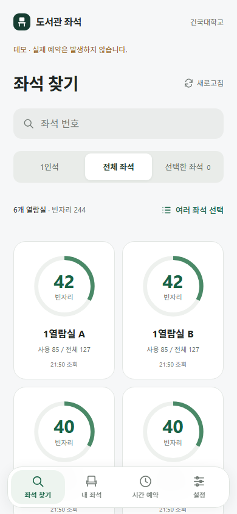
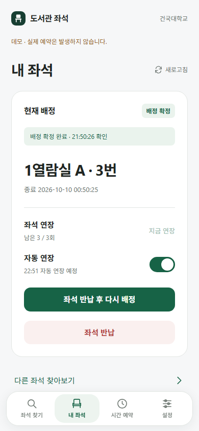
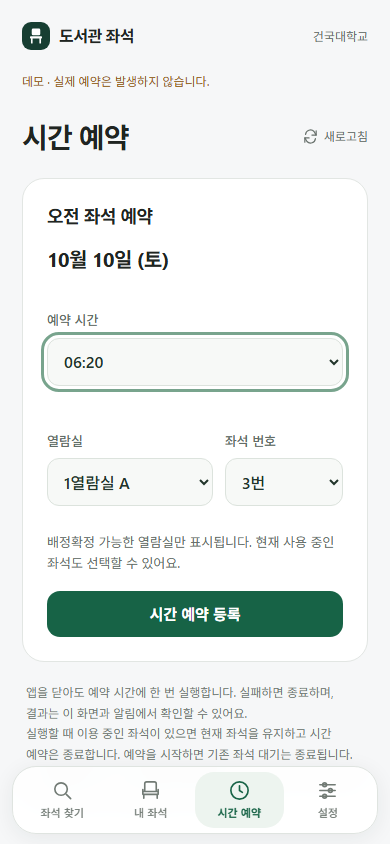
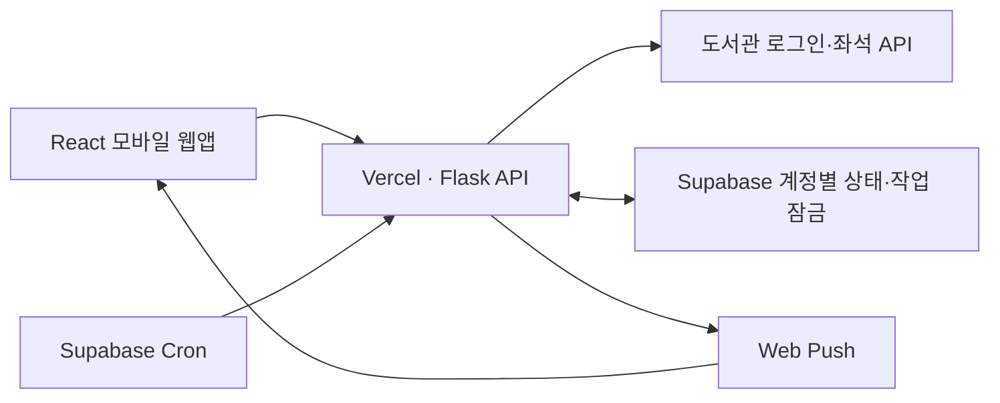

# 도서관 좌석

건국대학교 도서관의 좌석 찾기, 예약·배정확정, 자동 연장과 다음 오전 시간 예약을 한곳에서 사용하는 모바일 웹앱입니다. 화면을 닫아도 운영 서버에서 등록한 작업을 계속합니다.

**[웹앱 열기](https://library-seat-dusky.vercel.app)** · [배포·운영 가이드](DEPLOY.md)

## 화면 예시

| 좌석 찾기 | 내 좌석 | 시간 예약 |
| :---: | :---: | :---: |
|  |  |  |

화면은 가상 좌석을 사용하는 로컬 데모에서 촬영했습니다. 실제 계정·예약 정보는 포함하지 않습니다.

## 주요 기능

| 기능 | 동작 |
| --- | --- |
| 좌석 찾기 | 1열람실 A/B, 2열람실, 3열람실 A/B, 5열람실의 현황을 확인하고 좌석 번호로 검색합니다. 1인석 모음과 빈자리 필터를 제공합니다. |
| 빈자리 예약 | 대기 등록 없이 즉시 예약하고 배정확정까지 진행합니다. |
| 여러 좌석 대기 | 사용 중인 좌석을 최대 50개 선택합니다. 먼저 확보한 한 좌석을 확정하면 나머지 대기를 종료합니다. |
| 갈아타기 | 현재 좌석을 유지하며 기다리다가 새 좌석을 예약·확정합니다. 예약이 명확히 거절되면 원래 좌석의 복구·확정을 시도합니다. |
| 자동 연장 | 확정 좌석에서 기본으로 켜지며 잔여 **1시간 59분**에 연장합니다. 남은 횟수가 0이면 같은 좌석을 반납·재배정·확정하고 계속합니다. |
| 시간 예약 | 다음 오전 **05:00~11:50**, 10분 단위로 한 건을 등록합니다. 지정 시각에 예약·확정하고 자동 연장을 켭니다. 실패하면 종료합니다. |
| 알림 | 배정·연장 성공과 작업 실패를 웹 푸시로 알립니다. 기기별로 알림 종류를 설정할 수 있습니다. |
| 내 좌석 | 배정 상태, 종료 시간과 남은 연장 횟수를 확인하고 연장·반납·동일 좌석 재배정을 실행합니다. |

## 사용하기

1. 도서관 **아이디와 비밀번호**로 로그인합니다. 학번 로그인은 지원하지 않습니다.
2. `좌석 찾기`에서 열람실과 좌석을 선택합니다. 빈자리는 바로 예약하고, 사용 중인 자리는 대기에 추가합니다.
3. `내 좌석`에서 배정 상태와 자동 연장을 확인합니다. 직접 끈 자동 연장은 해당 배정에서 꺼진 상태를 유지하며, 새 배정은 다시 기본으로 켜집니다.
4. 다음 오전에 사용할 자리는 `시간 예약`에서 지정합니다. 등록 시간은 **전날 12:00부터 당일 05:00 전까지**입니다.
5. `설정 → 알림`에서 이 기기의 알림을 허용합니다. iPhone은 Safari에서 **홈 화면에 추가**한 웹앱을 열어 알림을 허용해야 합니다.

시간은 한국 시간 기준입니다. 운영 배포에서는 브라우저 종료·로그아웃 후에도 서버가 작업을 이어갑니다. 자동로그인을 선택하면 인증 만료 시 저장된 로그인 정보로 재연결합니다.

### 알아둘 동작

- 여러 좌석 대기는 선택한 순서로 시도합니다. 대상 중 하나가 0~1분 남았거나 비어 있으면 목표 1초 간격으로 확인하고, 그 외에는 30초 간격으로 확인합니다. 실제 간격은 서버 응답과 실행 지연에 따라 달라질 수 있습니다.
- 갈아타기와 동일 좌석 재배정은 반납 사이에 다른 사람이 자리를 잡을 수 있습니다. 원래 좌석 복구도 보장되지 않습니다.
- **23:00~05:00**에는 연장이 한 번 실패하면 오전 5시까지 자동 재시도를 멈춥니다. 해당 시간에는 연장 횟수 소진에 따른 자동 재배정도 하지 않습니다.
- 시간 예약 시 이미 이용 중인 좌석이 있으면 그 좌석을 유지하고 시간 예약만 실패로 종료합니다.
- 결과가 불명확한 예약·확정·연장 요청은 자동으로 재전송하지 않습니다. 공식 앱에서 최종 상태를 확인해 주세요.
- 배정확정·연장은 서버에 등록된 공통 NFC 태그로 요청합니다. 웹앱이 iPhone의 NFC를 직접 읽지는 않습니다. 임시배정 자동 취소·재예약은 사용하지 않습니다.

## 구조



| 위치 | 역할 |
| --- | --- |
| `frontend/src/` | 화면, 좌석 탐색, 상태 조회와 알림 설정 |
| `seat_service.py` | 예약·갈아타기·배정확정·연장·시간 예약의 실행과 결과 검증 |
| `cloud_service.py` | 계정별 상태 저장, 실행 잠금, 서버 스케줄링과 알림 전달 |
| `library_login.py` | 공식 도서관 로그인 API를 통한 인증 |
| `library_config.py` | 1인석 모음의 좌석 목록 |
| `webapp.py` / `app.py` | Flask 라우트·인증과 로컬 / Vercel 진입점 |
| `push_notifications.py` | 푸시 구독 검증·암호화·전송 |
| `supabase/` | 계정별 저장소·Cron 설정과 적용 이력 |
| `tests/` | 가상 도서관 클라이언트 기반 서버·브라우저 검증 |
| `public/` | Vite가 생성한 정적 배포 파일 |

계정마다 좌석·작업 상태와 잠금을 분리합니다. 도서관 토큰·쿠키와 선택적으로 저장하는 로그인 정보는 서버에서 암호화하며, NFC 태그와 서버 키를 브라우저에 전달하지 않습니다. 요청 결과를 다시 조회해 확인하고, 외부 쓰기 전에 상태를 저장해 중복 실행을 막습니다.

## 로컬 데모

Python 3.10 이상과 Node.js 24를 사용합니다. 데모 실행에는 Chrome이 필요하지 않습니다.

```powershell
python -m venv .venv
.\.venv\Scripts\Activate.ps1
pip install -r requirements.txt
npm ci
npm run build
$env:LIBRARY_WEB_PASSWORD="local-demo-password-change-me"
$env:LIBRARY_COOKIE_SECURE="0"
python webapp.py --demo
```

`http://127.0.0.1:8080`에 접속해 위 웹앱 비밀번호로 로그인합니다. **데모는 도서관에 요청하지 않습니다.** 실제 로컬 사용은 `--demo`를 빼고 실행한 뒤 화면에서 도서관 아이디로 연결합니다. 로컬 자동 실행에는 PC가 켜져 있어야 합니다.

화면을 개발할 때는 Flask를 `python webapp.py --demo --port 8765`로 실행하고, 다른 터미널에서 `npm run dev`를 실행합니다. Vite가 `/api` 요청을 로컬 Flask로 전달합니다.

## 검증과 화면 예시 갱신

```powershell
pip install -r requirements-dev.txt
npm test
python -m unittest discover -s tests -v
npm run build
python tests/smoke_browser.py
# README 화면 예시도 새로 촬영
python tests/smoke_browser.py --update-docs
```

브라우저 검증에만 Google Chrome과 Selenium을 사용합니다. 320·390px 모바일 화면, 좌석 검색·예약·갈아타기 복구·연장·시간 예약을 로컬 데모로 검증하며 실제 좌석을 변경하지 않습니다. 아이콘은 `python scripts/build_icons.py`로 다시 생성할 수 있습니다.

## 배포와 설정

운영 환경은 Vercel과 Supabase를 사용합니다. 환경변수, DB 마이그레이션, Cron과 Web Push 설정은 **[DEPLOY.md](DEPLOY.md)**를 참고하세요.

`frontend/src/` 또는 정적 원본을 바꾸면 `npm run build`를 실행하고 생성된 `public/`도 함께 커밋합니다. 현재 Vercel Flask 배포의 정적 파일 수집을 위해 빌드 결과를 저장소에 포함합니다. `public/`은 직접 수정하지 않습니다.

좌석 제외 규칙은 `seat_service.py`에서 관리합니다. 1열람실 B의 409번 이상과 3열람실 B의 149·150·207·279·325·326·347·348번은 조회·예약·대기 대상에서 제외합니다.

이 프로젝트는 건국대학교의 공식 서비스가 아닌 개인 보조 도구입니다.
